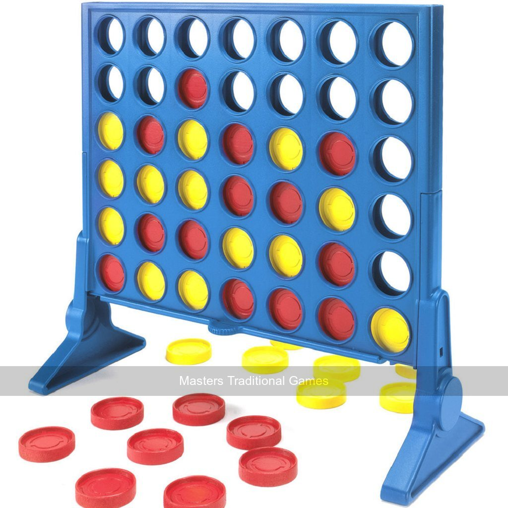

# HW3

## Problem
Implement functionality of a 2-player game and Minimax algorithm to play it.

## Solution
I chose `Connect4` game for this homework.

All codes are available under `Codes` directory and also implementation is described in the `Connect4_Minimax.ipynb` in details. 