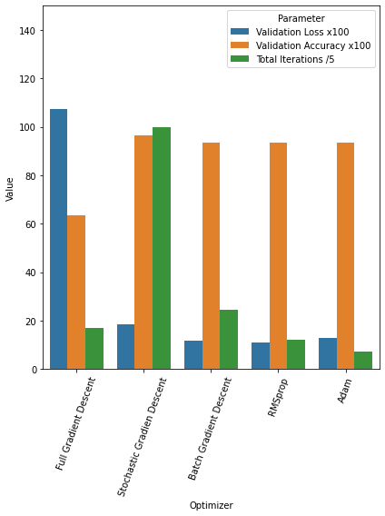

# HW6

## Problem
Compare performance different neural network optimization algorithms on `IRIS` dataset classification task.

## Resources
`IRIS` dataset is imported from `sklearn` library. You can find more information about the dataset [here](https://scikit-learn.org/stable/modules/generated/sklearn.datasets.load_iris.html).

Also `keras` library is used to build and optimize neural network models.

Total of 5 optimization algorithms are used to compare performance:

- `Gradient Descent`
- `Stochastic Gradient Descent`
- `Batch Gradient Descent`
- `RMSProp`
- `Adam`

All codes and comparision details are available in `NNOptimizersComparision.ipynb` file.

## Results
It was not a surprise that `Adam` optimizer performed the best. Chart below shows information of each optimizer's performance:

